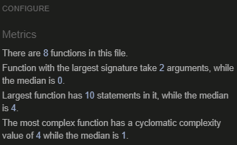
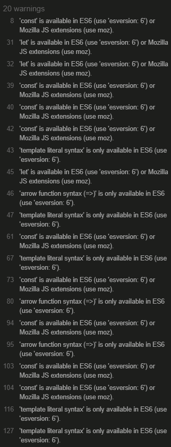

# Kids quiz Application

This is a simple interactive quiz application built using JavaScript, HTML, and CSS. It presents a series of multiple-choice questions, evaluates the user's answers, and provides feedback on their performance at the end. The app also allows users to restart the quiz once it's completed.

## Features

- Multiple-choice questions with four answer options.
- Immediate feedback on selected answers (correct answers turn green, incorrect answers turn red).
- A score system where correct answers earn points.
- A reward message is displayed at the end based on the user's score.
- Option to restart the quiz after completion.

## Testing

- Testing was made in JSHint
  
  

## How It Works

1. When the page is loaded, the first question and its answer options are displayed.
2. The user selects an answer by clicking on one of the answer buttons.
3. The selected answer is evaluated:
   - If the answer is correct, the button turns green, and the user earns points.
   - If the answer is incorrect, the button turns red.
4. After answering, the correct answer is highlighted, and the user cannot select answers for the current question.
5. The next question is displayed after a short delay.
6. When all questions are answered, a final score is displayed with a reward message based on the score range.
7. The user can restart the quiz by clicking the restart button.

## Deployment

### Version Control

- The site was created using Gitpod editor with VCODE plugin and pushed to Github to the remote repository 'Kids quiz'.
- Git commands were used throughout the development to push the code to the remote repository. The following git commands were used:
  - git add . - to add the files to the staging area before being committed.
  - git commit -m "commit message" - to commit changes to the local repository queue that are ready for the final step.
  - git push - to push all committed code to the remote repository on Github.

### Deployment to Github pages

- The site was deployed to Github pages

## Credits

- Big time help with advice from my mentor Herr Spencer Barriball. TNX

### Media

- Background picture was made with Adobe Photoshop
